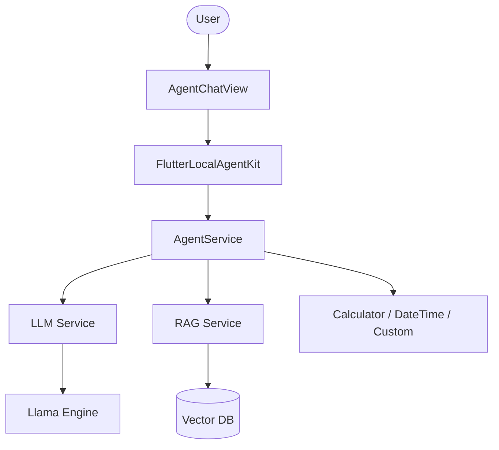

# Flutter Local Agent Kit 🤖

[](https://pub.dev/packages/flutter_local_agent_kit)
[](https://flutter.dev/docs/development/packages-and-plugins/favorites)
[](https://opensource.org/licenses/MIT)

**The production-ready, offline-first framework for building powerful AI agents in Flutter.**

`flutter_local_agent_kit` orchestrates high-performance LLM inference, secure local RAG (Vector Search), and autonomous tool-using agents—all running 100% on-device. No cloud, no latency, 100% privacy.

---

## ✨ Features

- **🚀 Resident LLM Core**: High-speed GGUF inference powered by `llamadart`.
- **📚 Private RAG**: Local vector database for semantic search and document grounding via `mobile_rag_engine`.
- **🛠️ Agentic Intelligence**: Autonomous "Reasoning + Action" (ReAct) loop for tool-augmented problem-solving.
- **🎨 Premium UI**: Optimized Markdown chat components using `ValueNotifier` for jank-free streaming.
- **📦 Model Management**: Background downloads and model integrity checks out of the box.

---

## 🏗️ Architecture



---

## 🚀 Quick Start

### 1. Initialize the Kit

```dart
import 'package:flutter_local_agent_kit/flutter_local_agent_kit.dart';

final kit = FlutterLocalAgentKit();

await kit.initialize(
  modelPath: 'path/to/llama-3-8b.gguf',
  ragDatabasePath: 'path/to/my_knowledge.db',
);
```

### 2. Ingest Knowledge

```dart
await kit.ingestFile('knowledge_base.pdf');
```

### 3. Run the AgentChatView

```dart
AgentChatView(
  onMessage: (query) => kit.askStream(query),
)
```

---

## 🔋 Hardware Requirements

- **Android**: ARM64 / x86_64, Android 7.0+, NPU acceleration where available.
- **iOS**: iOS 13.0+, Metal acceleration supported.
- **Desktop**: Windows/macOS/Linux support with full GPU offloading.

---

## 🔒 Privacy & Security

Every byte of data remains on the user's device. This kit is designed for:
- Healthcare & Legal apps
- Corporate knowledge bases
- Offline-first field tools
- Privacy-conscious personal assistants

---

## 🤝 Contributing

We welcome contributions! See [CONTRIBUTING.md](doc/CONTRIBUTING.md) for details on how to add new tools, prompt templates, or engine optimizations.

---

## 📄 License

This project is licensed under the MIT License - see the [LICENSE](LICENSE) file for details.

---

Built with ❤️ by the Flutter AI Community.