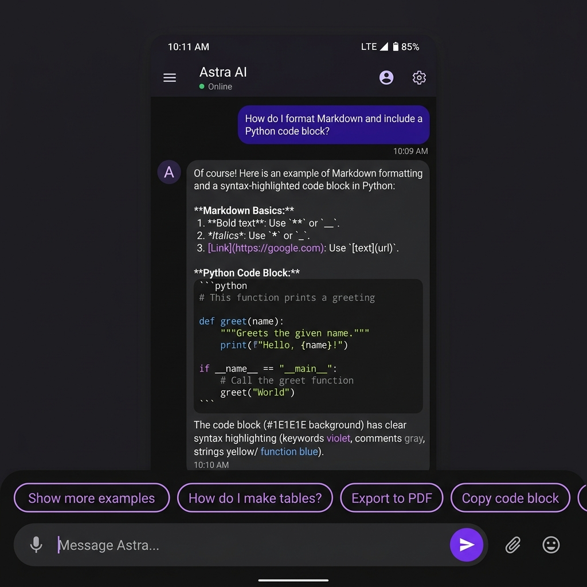
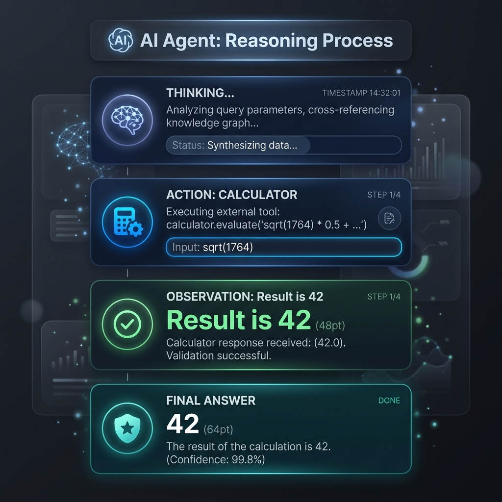
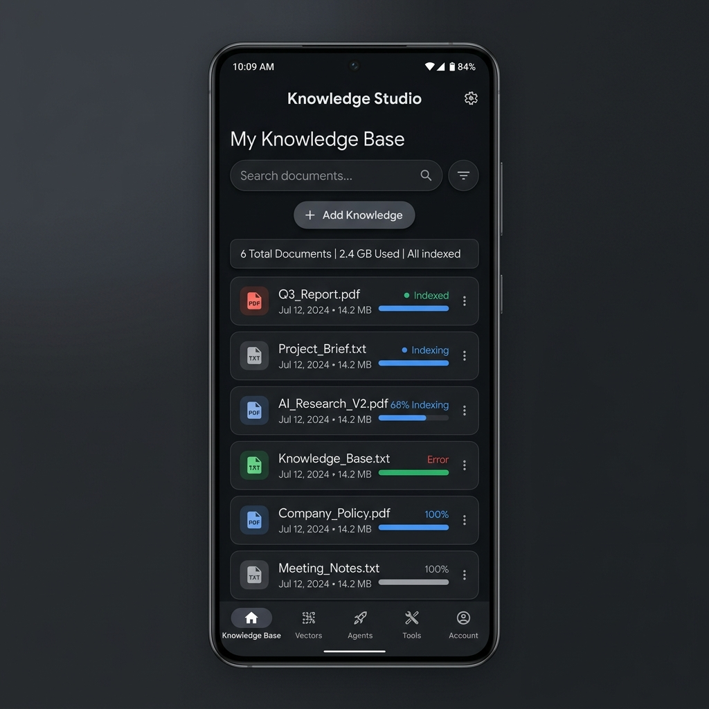

<p align="center">
  <a href="https://pub.dev/packages/flutter_local_agent_kit"></a>
  <a href="https://pub.dev/packages/flutter_local_agent_kit/score"></a>
  <a href="https://opensource.org/licenses/MIT"></a>
  
  <a href="https://github.com/Akash-ptl/flutter_local_agent_kit/stargazers"></a>
</p>

# 🤖 flutter_local_agent_kit

Run powerful autonomous AI agents completely offline in your Flutter apps. 

> Local LLM inference (via llamadart) • Private RAG • ReAct agents • Beautiful Material 3 Chat UI • No cloud • No API keys • Full privacy.

---

## 📑 Table of Contents
- [✨ Key Features](#-key-features)
- [📱 Screenshots](#-screenshots)
- [🚀 Quick Start / Installation](#-quick-start--installation)
- [⚡ Performance Benchmarks](#-performance-benchmarks)
- [🛠️ Built-in Tools](#️-built-in-tools)
- [🧠 Advanced Usage](#-advanced-usage)
- [🎮 Demo App](#-demo-app)
- [🗺️ Roadmap / Future Plans](#️-roadmap--future-plans)
- [🤝 Contributing](#-contributing)
- [📄 License & Acknowledgments](#-license--acknowledgments)

---

## ✨ Key Features

- **🚀 High-performance on-device inference**: Up to **45+ tokens/sec** on flagship mobile devices.
- **🕵️ Fully autonomous ReAct agents**: Integrated tool calling enables agents to reason and act on data entirely offline.
- **📚 Local RAG with vector database**: Inject private knowledge bases securely; data never leaves the device.
- **🎨 Premium AgentChatView**: Ready-to-use Material 3 UI with markdown support, customizable suggestion chips, and real-time streaming.
- **🔧 Built-in tools + easy custom tools**: Start instantly with calculators and date pickers, or easily subclass `BaseTool` for custom integrations.
- **🧠 Multiple model support**: Seamlessly run state-of-the-art models like Llama 3.2, Gemma, and Mistral.
- **🛡️ Fallback to LLM-only**: Automatically degrade gracefully when the RAG component is unavailable.
- **🌐 Cross-platform support**: Built for modern Flutter targeting Desktop (macOS/Windows/Linux), Android, iOS, and Web.

---

## 📱 Screenshots

<p align="center">
  
  
  
</p>

---

## 🚀 Quick Start / Installation

Add the package to your pubspec:

```bash
flutter pub add flutter_local_agent_kit
```

### Basic Initialization
```dart
import 'package:flutter_local_agent_kit/flutter_local_agent_kit.dart';

final kit = FlutterLocalAgentKit();

await kit.initialize(
  modelPath: '/path/to/llama-3.2-1b.gguf',
);

// Fallback checking
if (!kit.isRagReady) {
  debugPrint('RAG unavailable: ${kit.ragInitializationError}');
}
```

### Running a Simple Agent
```dart
// Stream "Thought -> Action -> Observation -> Final Answer"
kit.runAgent("Calculate my tax for 50k salary and tell me the time.")
   .listen((chunk) {
      print(chunk); 
   });
```

### Using AgentChatView
```dart
import 'package:flutter_local_agent_kit/ui.dart';

AgentChatView(
  onMessage: (query) => kit.runAgent(query),
  suggestions: const [
    '🕵️ Who are you?', 
    '📅 Get Time', 
    '🧮 Solve math'
  ],
  welcomeMessage: "Hello! I am your completely private, offline AI agent. How can I help you today?",
)
```

### Adding Custom Tools
```dart
class WeatherTool extends BaseTool {
  @override
  String get name => 'weather_tool';
  
  @override
  String get description => 'Get the current weather for a location.';

  @override
  Future<String> execute(String input) async {
    // In an offline setting, this might check a local weather cache 
    // or trigger a specific device sensor.
    return "The weather in $input is Sunny and 72°F.";
  }
}

// Pass tools to the agent directly
kit.runAgent("What's the weather like?", tools: [WeatherTool()]);
```

---

## ⚡ Performance Benchmarks

Built natively on top of highly optimized inference wrappers (`llamadart`, Vulkan/Impeller), `flutter_local_agent_kit` achieves true desktop-class speed right on your mobile device.

**Real On-Device Numbers (OnePlus 12):**
*   **Model**: Llama 3.2 1B (Instruct)
*   **RAM Usage**: ~900MB (Stable)
*   **Throughput**: 45+ tokens/sec
*   **Latency**: < 100ms time-to-first-token

*Note: Performance scales dynamically based on individual hardware NPU/GPU capabilities.*

---

## 🛠️ Built-in Tools

The kit comes pre-packaged with several essential tools to get your agent reasoning safely:
*   **🧮 Calculator**: High-precision math execution to prevent hallucinated numbers.
*   **📅 DateTime**: Real-time context awareness so agents always know "when" it is.
*   **🧑‍💻 Custom Tools**: Easily extend with the typed `BaseTool` class.

---

## 🧠 Advanced Usage

### Custom Personas
Easily inject custom system prompts to shape your agent's behavior:
```dart
await kit.initialize(
  modelPath: '/path/to/model.gguf',
  systemPrompt: "You are a seasoned pirate captain. Answer all queries in pirate speak."
);
```

### Inject a Custom Runtime Adapter
`KitRuntimeAdapter` lets you mock or swap how LLM and RAG sessions are created. Perfect for unit testing or custom low-level memory handling.

```dart
final kit = FlutterLocalAgentKit(
  runtimeAdapter: MockRuntimeAdapter(),
);
```

---

## 🎮 Demo App

Want to see it in action without writing a line of code? 

Navigate to the [`example/`](example/) directory in this repository and run the full premium demo app to experience autonomous tools and local knowledge retrieval.

```bash
cd example
flutter run
```

---

## 🗺️ Roadmap / Future Plans

- [ ] Built-in PDF/Text parsing for instant RAG ingestion
- [ ] Multimodal model support (Local Vision)
- [ ] Multi-agent orchestration (letting multiple agents talk to each other)
- [ ] Persistent agent memory and conversational history saving
- [ ] Support for native CoreML / NNAPI inference delegates 

---

## 🤝 Contributing

We welcome your contributions to make offline AI on Flutter even better!

### How to contribute
1. Fork the repository
2. Create a feature branch (`git checkout -b feature/amazing-feature`)
3. Commit your changes (`git commit -m 'feat: added amazing feature'`)
4. Push to the branch (`git push origin feature/amazing-feature`)
5. Open a Pull Request

**Good First Issues:**
Looking to get involved? Try creating a new tool subclass (e.g., a simple offline file-reader tool) or adding unit tests for the core logic! Check our issue tracker.

---

## 📄 License & Acknowledgments

**License:** MIT License. Built with ❤️ for the Flutter Ecosystem (2026).

**Acknowledgments:**
* A massive thank you to the [llamadart](https://pub.dev/packages/llamadart) team for bridging powerful LLM backends to Dart.
* The Flutter community for pushing the boundaries of what's possible on edge devices.

---

<p align="center">
  <sub><strong>GitHub Topics:</strong> <code>flutter</code> <code>ai</code> <code>llm</code> <code>offline</code> <code>rag</code> <code>local-ai</code> <code>agent</code> <code>privacy</code> <code>llamadart</code> <code>react-agents</code> <code>mobile-ai</code></sub>
</p>
