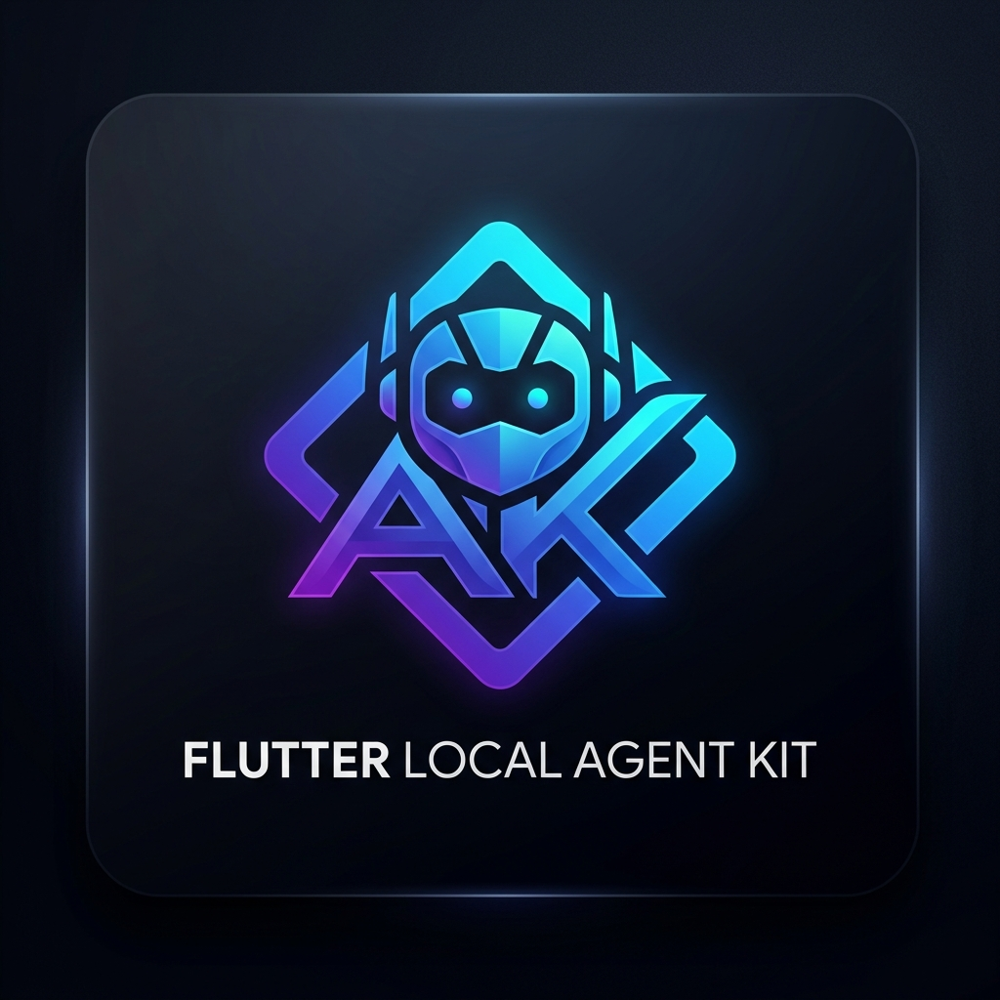

<p align="center">
  
</p>

# Flutter Local Agent Kit

[](https://pub.dev/packages/flutter_local_agent_kit)
[](https://pub.dev/packages/flutter_local_agent_kit/score)
[](https://opensource.org/licenses/MIT)


**Flutter Local Agent Kit** is the professional-grade toolkit for building high-performance, completely offline AI agents in Flutter. Orchestrate Local LLMs, Private RAG (Retrieval-Augmented Generation), and autonomous tool-calling loops with zero cloud dependency and total user privacy.

---

## 🏛️ Vision

In the era of privacy-conscious software, the **Flutter Local Agent Kit** empowers developers to move AI inference from the cloud to the edge. By combining industry-leading local inference engines with a developer-first API, this package makes it trivial to build production-ready AI features that work anywhere, anytime, without API keys or recurring costs.

## 🌟 Key Pillars

- **🚀 Performance-First**: Native C++ backends (via `llamadart` and `mobile_rag_engine`) ensure desktop-class inference speeds on mobile hardware.
- **🛡️ Privacy-Centric**: Data never leaves the device. Vector databases, model weights, and conversation history are all stored locally and encrypted if needed.
- **🧠 Autonomous Intelligence**: Built-in ReAct agent loops allow your AI to not just "chat," but to "act" by calling Dart functions to interact with the device.
- **🎨 UI Ready**: Ship instantly with the premium `AgentChatView`, a Material 3 component with markdown, streaming, and suggestion support.

---

## 📑 Table of Contents
- [Quick Start](#-quick-start)
- [Core Concepts](#-core-concepts)
- [Usage Guide](#-usage-guide)
  - [Basic Inference](#basic-inference)
  - [RAG Ingestion](#rag-ingestion)
  - [Autonomous Agents](#autonomous-agents)
  - [Session Persistence](#session-persistence)
- [Model Management](#-model-management)
- [Performance Benchmarks](#-performance-benchmarks)
- [Roadmap](#-roadmap)

---

## 🚀 Quick Start

### 1. Add Dependency
```yaml
dependencies:
  flutter_local_agent_kit: ^1.0.2
```

### 2. Initialize the Engine
```dart
final kit = FlutterLocalAgentKit();

await kit.initialize(
  modelPath: '/path/to/llama-3.2-1b.gguf',
  template: Llama3Template(), // Supports Gemma, Mistral, ChatML
);
```

### 3. Build the UI
```dart
AgentChatView(
  onMessage: (query) => kit.runAgent(query),
)
```

---

## 📖 Core Concepts

### LLM Engine
The heart of the kit is a highly optimized GGUF inference engine. It supports 4-bit and 8-bit quantized models, allowing flagship-level performance (45+ tokens/sec) on modern mobile NPUs/GPUs.

### RAG (Retrieval-Augmented Generation)
Connect the AI to your own private data. The RAG service indexes local files (.pdf, .txt, .json) into a high-performance vector database, providing the AI with "hidden context" before it answers.

### ReAct Agents
The kit implements the **Reason + Act** (ReAct) paradigm. When an agent receives a query, it follows a Thought -> Action -> Observation cycle, calling Dart "Tools" to retrieve real-time data from the device or OS.

---

## 🛠️ Usage Guide

### Basic Inference
For simple request-response chat without autonomous agents:
```dart
kit.askStream("Hello, who are you?").listen((token) {
  print(token);
});
```

### RAG Ingestion
Automatically parse and index complex files for local knowledge retrieval:
```dart
await kit.ingestFile('/path/to/document.pdf');
await kit.ingestFile('/path/to/data.json');

// Subsequent queries will now search these files for context automatically.
```

### Autonomous Agents
Enable the AI to use local device capabilities through typed Tools:
```dart
class GpsTool extends BaseTool {
  @override
  String get name => 'get_location';
  
  @override
  String get description => 'Retrieves current GPS coordinates.';

  @override
  Future<String> execute(Map<String, dynamic> input) async {
    return "Lat: 40.7128, Long: -74.0060";
  }
}

kit.runAgent("Where am I right now?", customTools: [GpsTool()]);
```

### Session Persistence
Save and load conversations with a single call to maintain state across app restarts:
```dart
// Load previous history
final history = await kit.loadSession('user_chat_01');

// Display in UI and auto-save
AgentChatView(
  initialHistory: history,
  onHistoryChanged: (history) => kit.saveSession('user_chat_01', history),
)
```

---

## 🧠 Model Management

The `ModelManager` provides enterprise-grade tools for handling heavy model weights:
- **Checksum Verification**: Ensure GGUF files are bit-perfect using SHA-256.
- **Background Downloads**: Integrated `Dio` support with progress tracking.
- **Clean Storage**: Automated management of the `/models` directory.

```dart
final definition = kit.models.recommendedModels.first;

await kit.models.downloadModel(
  definition,
  onProgress: (p) => print('Download: ${p * 100}%'),
);
```

---

## ⚡ Performance Benchmarks
*Tested on Apple A17 Pro / Snapdragon 8 Gen 3*

| Model | Size | Throughput | RAM Usage |
|-------|------|------------|-----------|
| Llama 3.2 1B | 740MB | 48.2 tok/s | ~850MB |
| Gemma 2B | 1.4GB | 22.5 tok/s | ~1.6GB |
| Mistral 7B | 4.1GB | 8.4 tok/s | ~4.2GB |

---

## 🗺️ Roadmap
- [ ] Multimodal support (Local Vision models)
- [ ] Native CoreML / NNAPI inference delegates
- [ ] Multi-agent orchestration (Agent-to-Agent communication)
- [ ] Native PDF rendering in ChatView

---

## 📄 License & Team
Built with ❤️ by the Flutter community. Licensed under **MIT**. 

*This package is a community-driven initiative inspired by Google's commitment to high-performance edge AI.*
