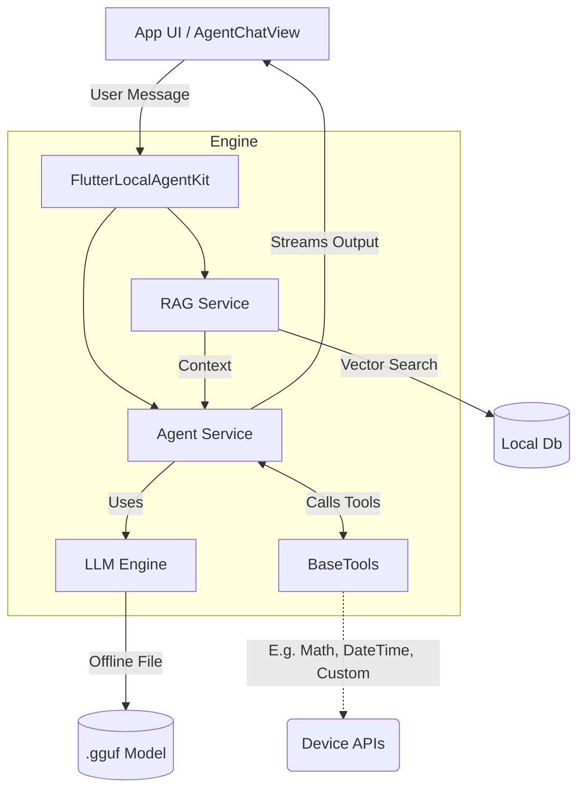

<p align="center">
  <a href="https://pub.dev/packages/flutter_local_agent_kit"></a>
  <a href="https://pub.dev/packages/flutter_local_agent_kit/score"></a>
  <a href="https://opensource.org/licenses/MIT"></a>
  
  <a href="https://github.com/Akash-ptl/flutter_local_agent_kit/stargazers"></a>
</p>

# 🤖 flutter_local_agent_kit

Run powerful autonomous AI agents completely offline in your Flutter apps. 

> Local LLM inference (via llamadart) • Private RAG • ReAct agents • Beautiful Material 3 Chat UI • No cloud • No API keys • Full privacy.

---

## 📑 Table of Contents
- [✨ Key Features](#-key-features)
- [📖 Beginner's Glossary](#-beginners-glossary)
- [🏗️ Architecture & How It Works](#️-architecture--how-it-works)
- [🚀 Tutorial: Quick Start](#-tutorial-quick-start)
- [⚡ Performance Benchmarks](#-performance-benchmarks)
- [🛠️ Built-in Tools](#️-built-in-tools)
- [🧠 Advanced Usage](#-advanced-usage)
- [🎮 Demo App](#-demo-app)
- [🗺️ Roadmap / Future Plans](#️-roadmap--future-plans)
- [🤝 Contributing](#-contributing)
- [📄 License & Acknowledgments](#-license--acknowledgments)

---

## ✨ Key Features

- **🚀 High-performance on-device inference**: Up to **45+ tokens/sec** on flagship mobile devices.
- **🕵️ Fully autonomous ReAct agents**: Integrated tool calling enables agents to reason and act on data entirely offline.
- **📚 Local RAG with vector database**: Inject private knowledge bases securely; data never leaves the device.
- **🎨 Premium AgentChatView**: Ready-to-use Material 3 UI with markdown support, customizable suggestion chips, and real-time streaming.
- **🔧 Built-in tools + easy custom tools**: Start instantly with calculators and date pickers, or easily subclass `BaseTool` for custom integrations.
- **🧠 Multiple model support**: Seamlessly run state-of-the-art models like Llama 3.2, Gemma, and Mistral.
- **🌐 Cross-platform support**: Built for modern Flutter targeting Desktop (macOS/Windows/Linux), Android, iOS, and Web.

---


## 📖 Beginner's Glossary

New to AI on mobile devices? Here is a quick cheat sheet to understand what this package does:

*   **LLM (Large Language Model):** The "brain". A neural network file (usually `.gguf` format) that can read text and generate text.
*   **GGUF:** A file format for LLMs optimized for running on CPUs and mobile GPUs. You download a single `.gguf` file (e.g., from HuggingFace) and feed it into this package.
*   **RAG (Retrieval-Augmented Generation):** A fancy way of saying "giving the LLM a local search engine". RAG lets the AI read your private PDFs, JSONs, or documents *before* answering a user's question, anchoring the AI in reality so it doesn't hallucinate.
*   **Agent / Tool Calling:** Instead of just chatting, an "Agent" is given a set of Tools (like a Calculator, or a function that checks the Weather). Before answering the user, the AI *thinks*, decides it needs help, and "calls" the tool.

---

## 🏗️ Architecture & How It Works

`flutter_local_agent_kit` acts as the grand orchestrator. You give it an LLM model, optional files for RAG, and define your tools. It automatically binds them together!



1. **User asks a question** via the provided `AgentChatView`.
2. **RAG Service** optionally scans the local database for relevant hidden context.
3. **Agent Service** looks at the question, context, and available tools.
4. **LLM** decides if a tool is needed. If true, it triggers your Dart code (e.g., getting GPS coordinates).
5. **Final Output** streams back to the UI in beautiful Markdown!

---

## 🚀 Tutorial: Quick Start

### Step 1: Install
Add the package to your pubspec:
```bash
flutter pub add flutter_local_agent_kit
```

### Step 2: Get a Model (`.gguf`)
To run this offline, you need a model file. The most popular lightweight models right now are Llama 3.2 1B or 3B.
1. Go to [HuggingFace (e.g., Llama 3.2 1B GGUF)](https://huggingface.co/bartowski/Llama-3.2-1B-Instruct-GGUF).
2. Download a `Q4` or `Q8` quantised version (e.g., `Llama-3.2-1B-Instruct-Q4-K_M.gguf`).
3. Place it in your device's documents directory during runtime, or ship it in your app's assets (though assets are large!).

### Step 3: Boot the Kit
Initialize the engine globally in your app.

```dart
import 'package:flutter_local_agent_kit/flutter_local_agent_kit.dart';

final kit = FlutterLocalAgentKit();

void startAi() async {
  await kit.initialize(
    // Point this to where you saved the GGUF file on the device
    modelPath: '/storage/emulated/0/Download/Llama-3.2-1B-Instruct.gguf',
  );

  // Optional: Check if RAG booted correctly
  if (!kit.isRagReady) {
    debugPrint('RAG unavailable: ${kit.ragInitializationError}');
  }
}
```

### Step 4: Show the Chat UI
We've built a premium chat interface so you don't have to! Just drop `AgentChatView` into your widget tree:

```dart
import 'package:flutter_local_agent_kit/ui.dart';

class MyOfflineChatScreen extends StatelessWidget {
  @override
  Widget build(BuildContext context) {
    return Scaffold(
      appBar: AppBar(title: Text('My Private AI')),
      body: AgentChatView(
        // The AgentChatView automatically passes the query to kit.runAgent!
        onMessage: (query) => kit.runAgent(query),
        suggestions: const [
          '🕵️ What can you do?', 
          '📅 What is the date?', 
          '🧮 Solve 144 / 12'
        ],
        welcomeMessage: "Hello! I am your completely private, offline AI agent.",
      ),
    );
  }
}
```

---

## ⚡ Performance Benchmarks

Built natively on top of highly optimized inference wrappers (`llamadart`, Vulkan/Impeller), `flutter_local_agent_kit` achieves true desktop-class speed right on your mobile device.

**Real On-Device Numbers (OnePlus 12):**
*   **Model**: Llama 3.2 1B (Instruct)
*   **RAM Usage**: ~900MB (Stable)
*   **Throughput**: 45+ tokens/sec
*   **Latency**: < 100ms time-to-first-token

*Note: Performance scales dynamically based on individual hardware NPU/GPU capabilities.*

---

## 🛠️ Built-in Tools

Tools are pure Dart classes that give your AI superpowers. The package includes safe defaults:
*   **🧮 Calculator**: High-precision math execution to prevent hallucinated numbers.
*   **📅 DateTime**: Real-time context awareness so agents always know "when" it is.

### Writing a Custom Tool
Want your AI to check the weather or fetch a user's location securely? Just extend `BaseTool`!

```dart
class WeatherTool extends BaseTool {
  @override
  String get name => 'weather_tool';
  
  @override
  String get description => 'Get the current weather for a location.';

  @override
  Future<String> execute(String input) async {
    // Write standard Dart code here! Look up a local database, or call an API.
    return "The weather in $input is Sunny and 72°F.";
  }
}

// Pass tools to the kit during initialization or runtime:
kit.runAgent("What's the weather like in Tokyo?", tools: [WeatherTool()]);
```

---

## 🧠 Advanced Usage

### Using Custom Models (Gemma, Mistral, Qwen)
By default, the package assumes you are using a **Llama 3** based model. If you download a different model type (e.g., Gemma or Mistral), you just need to pass the appropriate built-in template parameter so the engine knows how to talk to it!

```dart
await kit.initialize(
  modelPath: '/path/to/gemma-4.gguf',
  template: GemmaTemplate(), // Built-in templates: GemmaTemplate, MistralTemplate, ChatMlTemplate
);
```

### Custom Personas
Easily inject custom system prompts to shape your agent's behavior:
```dart
await kit.initialize(
  modelPath: '/path/to/model.gguf',
);

// Run the agent with a pirate persona just for this conversation!
kit.runAgent(
  "How are you?", 
  systemPrompt: "You are a seasoned pirate captain. Answer all queries in pirate speak."
);
```

### Inject a Custom Runtime Adapter
`KitRuntimeAdapter` lets you mock or swap how LLM and RAG sessions are created. Perfect for unit testing.

```dart
final kit = FlutterLocalAgentKit(
  runtimeAdapter: MockRuntimeAdapter(),
);
```

---

## 🎮 Demo App

Want to see it in action without writing a line of code? 

Navigate to the [`example/`](example/) directory in this repository and run the full premium demo app to experience autonomous tools and local knowledge retrieval.

```bash
cd example
flutter run
```

---

## 🗺️ Roadmap / Future Plans

* ⬜ Built-in PDF/Text parsing for instant RAG ingestion
* ⬜ Multimodal model support (Local Vision)
* ⬜ Multi-agent orchestration (letting multiple agents talk to each other)
* ⬜ Persistent agent memory and conversational history saving
* ⬜ Support for native CoreML / NNAPI inference delegates 

---

## 🤝 Contributing

We welcome your contributions to make offline AI on Flutter even better!

### How to contribute
1. Fork the repository
2. Create a feature branch (`git checkout -b feature/amazing-feature`)
3. Commit your changes (`git commit -m 'feat: added amazing feature'`)
4. Push to the branch (`git push origin feature/amazing-feature`)
5. Open a Pull Request

**Good First Issues:**
Looking to get involved? Try creating a new tool subclass (e.g., a simple offline file-reader tool) or adding unit tests for the core logic! Check our issue tracker.

---

## 📄 License & Acknowledgments

**License:** MIT License. Built with ❤️ for the Flutter Ecosystem (2026).

**Acknowledgments:**
* A massive thank you to the [llamadart](https://pub.dev/packages/llamadart) team for bridging powerful LLM backends to Dart.
* The Flutter community for pushing the boundaries of what's possible on edge devices.

---

<p align="center">
  <sub><strong>GitHub Topics:</strong> <code>flutter</code> <code>ai</code> <code>llm</code> <code>offline</code> <code>rag</code> <code>local-ai</code> <code>agent</code> <code>privacy</code> <code>llamadart</code> <code>react-agents</code> <code>mobile-ai</code></sub>
</p>
